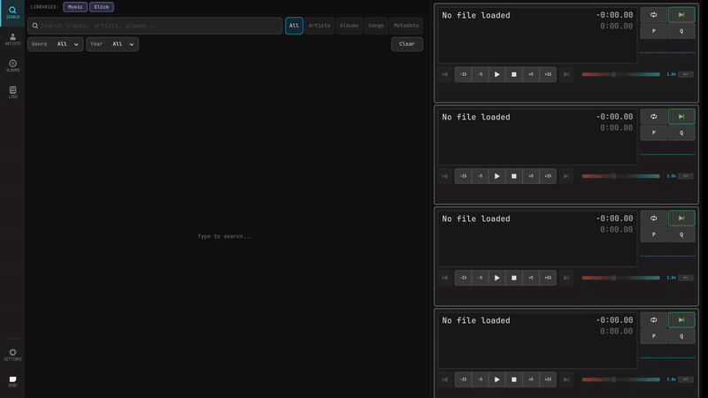
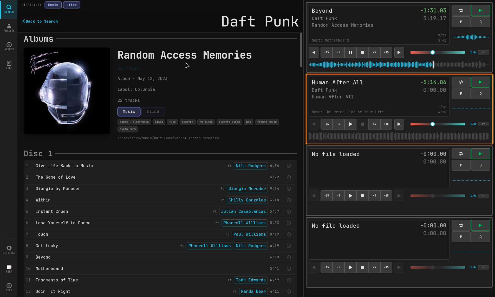
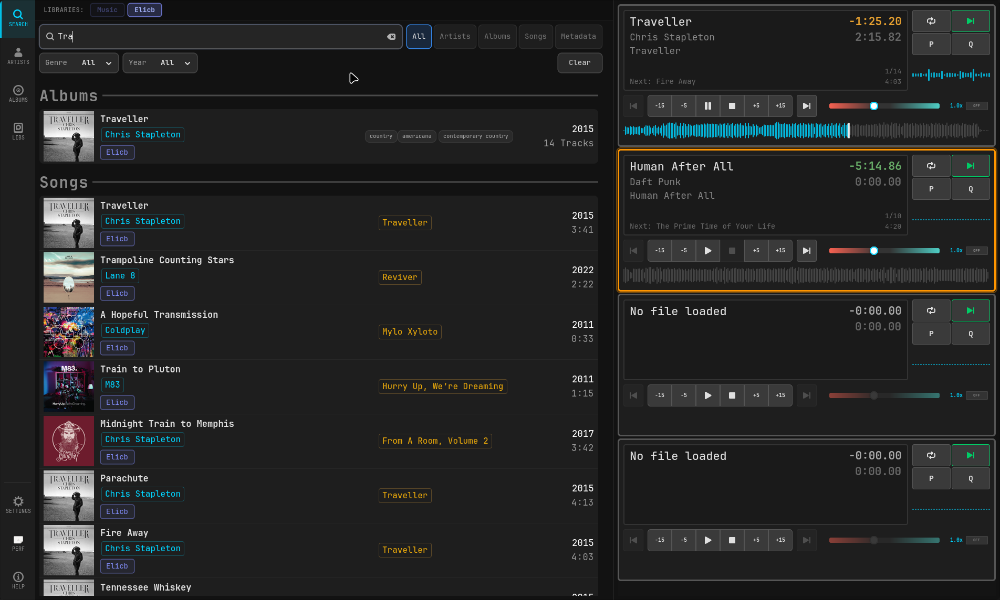
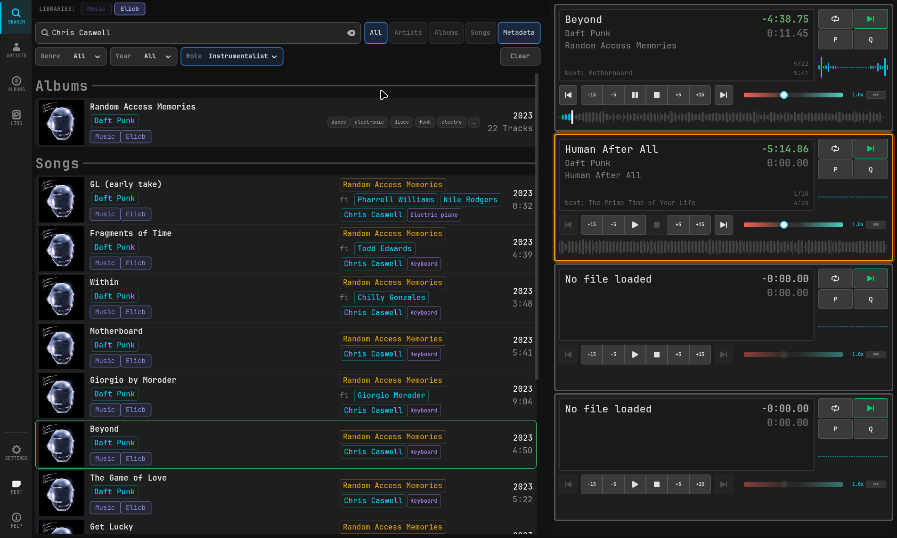
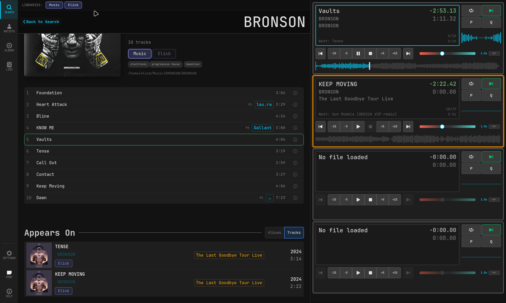

# Quadrature

A four-channel audio player for broadcast studios, written in C with GTK4.



|                                       4-track audio player                                        |                          Fast full-text search engine                          |
| :-----------------------------------------------------------------------------------------------: | :----------------------------------------------------------------------------: |
|                                              |                   |
|               **Full artist, recording, and instrumentalist data via MusicBrainz**                |               **Library credits, appears-on, and featuring UI**                |
|  |  |

## Features

- **4-Channel Playback** — independent transport, monitoring, and cue per channel
- **Broadcast Console Integration** — start/stop via GPIO, serial, and network
- **Preview/PFL** — monitor audio before going live
- **Professional Formats** — FFmpeg-based decoding (MP3, FLAC, WAV, OGG, AAC, BWF)
- **Music Library** — SQLite-backed with full-text search and MusicBrainz enrichment

## Install

### Flatpak (recommended for most users)

Download the bundle for your architecture from the
[latest release](https://github.com/elicbarbieri/quadrature/releases/latest)
and install it directly:

```bash
# x86_64
wget https://github.com/elicbarbieri/quadrature/releases/latest/download/quadrature-x86_64.flatpak
flatpak install --user quadrature-x86_64.flatpak

# aarch64
wget https://github.com/elicbarbieri/quadrature/releases/latest/download/quadrature-aarch64.flatpak
flatpak install --user quadrature-aarch64.flatpak
```

Updates: re-download the latest bundle and run `flatpak install --user`

The Flatpak distribution only has the MusicBrainz REST API (rate-limited ≤0.91 req/sec) and AcoustID REST API (rate-limited ≤2.86 req/sec).
For large libraries and self-hosted musicbrainz postgresql mirrors or self-hosted AcoustID, use the native build below.

### Native build (studios, large libraries, low-latency)

Native builds avoid Flatpak's sandbox and FUSE overhead and can talk
directly to a self-hosted MusicBrainz Postgres mirror — orders of magnitude
faster than the public HTTP API for large library scans.

Recommended when:

- Library exceeds ~50,000 tracks
- Studio environment requiring tight audio latency (sub-5ms)
- You operate your own MusicBrainz mirror or AcoustID dataset

Install via Nix flakes:

```bash
# Install Nix
curl --proto '=https' --tlsv1.2 -L https://nixos.org/nix/install | sh -s -- --daemon

# Enable flakes (one-time, non-NixOS only)
mkdir -p ~/.config/nix && echo "experimental-features = nix-command flakes" >> ~/.config/nix/nix.conf

# Install
nix profile install github:elicbarbieri/quadrature

# Or run directly
nix run github:elicbarbieri/quadrature
```

Or build from source:

```bash
git clone https://github.com/elicbarbieri/quadrature.git
cd quadrature
nix develop
make production
sudo make install
```

## Configuration

Settings are stored in `~/.config/quadrature/settings.ini` (or
`~/.var/app/org.quadrature.Player/config/quadrature/settings.ini` under
Flatpak).

### MusicBrainz backend selection

Quadrature picks its MB backend automatically based on settings:

| Configuration                                                | Backend used                                           |
| ------------------------------------------------------------ | ------------------------------------------------------ |
| `[MusicBrainz] pg_conninfo=host=...` set (native build only) | PostgreSQL — direct queries to a self-hosted MB mirror |
| `pg_conninfo` empty or missing                               | HTTP — public musicbrainz.org REST API (1 req/sec)     |
